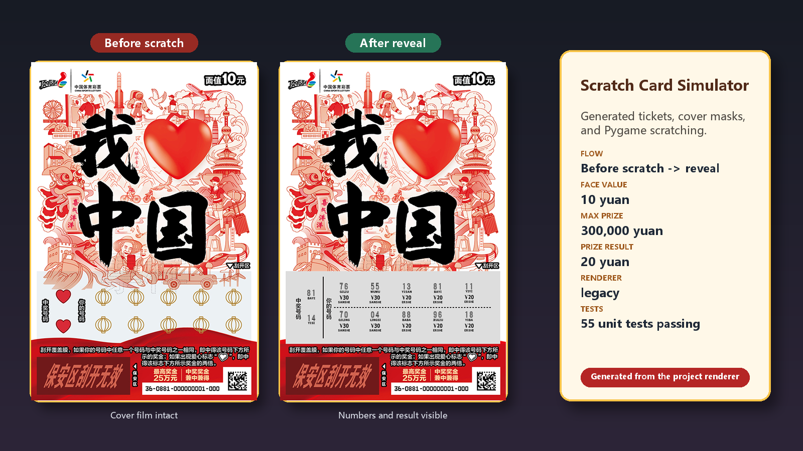

# Scratch Card Lottery Simulator



A local scratch-card lottery simulator built with Python, Tkinter, Pygame, and
Pillow. It includes account flow, ticket selection, generated ticket surfaces,
scratch interaction, prize claiming, and focused tests for the core logic.

This project is for local simulation and UI experimentation only. It is not
connected to any real lottery service.

## Features

- Local account registration and login.
- PBKDF2 password hashing for newly created local users.
- Automatic migration of legacy plaintext local passwords after successful
  login.
- Multiple ticket face values and generated scratch-card layouts.
- Pygame scratch interaction with zoom and rotation controls.
- Unit tests for account logic, image generation, and UI helpers.

## Install

```sh
python -m venv .venv
.venv\Scripts\activate
python -m pip install -r requirements.txt
```

## Run

```sh
python main.py
```

## Test

```sh
python -m unittest discover -s tests
```

## Repository Hygiene

The repository intentionally excludes local runtime data and build artifacts:

- `Datarecourses/UserData.json`
- `Datarecourses/LoginPreferences.json`
- generated `Datarecourses/current_*.png`
- `build/`, `dist/`, `_MEI*/`, `RuntimeTcl/`
- bundled system fonts under `Front/`

Use the example files in `Datarecourses/*.example.json` as safe templates.

## Packaging

`main.spec` is kept for PyInstaller builds, but runtime Tcl/Tk files and build
outputs are not committed. Rebuild them locally when needed.

## License

MIT
